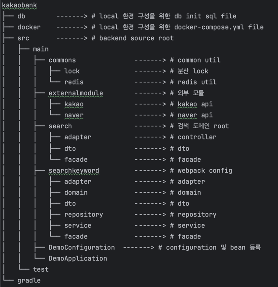

# 검색 시스템

## Local Test
1. docker 설치
2. kakaobank/docker directory로 이동
3. docker 띄우기
    ```
    docker-compose up
    ```
4. gradle build
5. DemoApplication 실행

## 주요 사용 기술 stack
- java
- spring boot
- docker
- docker-compose
- redis
- mysql
- JPA

## system architecture


### 사용 패턴
- facade 패턴
  * 도메인끼리 상호 참조하는 것을 방지하기 위해 facade 패턴을 적용하였다. (의존성이 한 방향으로 흐르도록 설계)
  * 예) 검색 
    * searchController -> searchFacade -> 검색 엔진 searchService 호출 및 searchKeyword 도메인의 검색어 저장
  * 예) 검색 키워드 조회
    * searchKeywordController -> searchKeywordFacade -> searchKeywordService -> 인기 검색어 조회
  * 현재 기능상으로는 search 도메인에서 searchKeyword 도메인의 검색어 저장 기능을 사용할 때, 이벤트를 활용하여 결합도가 낮추었지만 추후 기능 확정 시, 도메인 상호 참조를 막고자 하였다.

  
## 정책
### 검색어
- 검색어는 공백으로만 이루어진 경우, 검색어로 인정하지 않는다.
- 검색어는 띄어쓰기 포함 2글자 이상 10글자 이하로 제한한다.
### 같은 장소 기준
- 장소명을 기준으로 장소 비교를 한다.
- 장소명에 html tag와 공백을 제거하여 동일한 장소명일 경우, 같은 장소로 판단한다.
- 같은 장소일 경우, 검색 결과를 카카오 검색 결과 기준으로 응답한다.
### 검색 엔진 오류 
- 검색 엔진 오류는 검색 결과에 영향을 최소화하는 것을 목표로 하였다.
- 검색 엔진에 오류가 있으면, retry를 3번 한다.
- 최종적으로 검색 엔진 오류가 발생할 경우, 동일 키워드에 대한 검색 결과를 6시간동안 캐싱하고 이 데이터를 활용하여 사용자에게 노출한다.
- 만약, 캐싱처리된 데이터가 없더라도 사용자 향으로는 오류 상황에 대해 노출시켜주지 않고, 검색 결과를 null로 처리한다.
### 검색 결과 캐싱
- 검색 결과는 5분동안 캐싱처리하여 검색 엔진 api 호출을 최소화한다.
- 검색 결과 캐싱은 레디스를 활용하여 구현하였다.
### 검색어 저장
- 검색어와 관련된 데이터는 두 가지 종류로 저장한다.
  - 검색 시간 및 검색어 history
  - 검색어별 검색 횟수
- 분산 lock을 활용하여 동시성 이슈를 해결하였다.
- 인프라 등의 이유로 검색어 저장이 되지 않는다할지라도 메인비지니스인 검색에는 영향을 주지 않는다.
- ApplicationEvent를 활용하여 검색어 저장 시, 비동기로 처리하였고, 의존성 및 결합도를 낮추었다.

## 기술 결정 과정
- 동시성 - 분산락
  - 레디스(redisson)를 활용하여 분산락을 구현하였다.
- RestTemplate 설정
  - restTemplate를 사용하는 api call 마다 별도로 설정값을 생성할 수 있지만, 이번 과제에서는 통합하여 사용하였다.
  - timeout 설정은 검색 엔진 평균 응답시간이 1초가 넘지 않기에 버퍼시간을 포함하여 3초로 설정하였다.

## 추가적으로 추후 도입을 고려해볼 수 있는 기술
- 검색 엔진 이상 상황 발생 시, 써킷브레이커를 통해 검색 엔진으로 api 호출을 제한할 수 있다.

## API 명세
### swagger
- http://localhost:8080/swagger-ui.html
### 검색
- 검색어를 입력받아 검색 결과를 반환한다.
- url: /api/search
- method: GET
- request
    - keyword: 검색어
- response
  - placeName: 장소명
  - placeUrl: 장소 url
  - categoryName: 카테고리명
  - addressName: 주소명
  - roadAddressName: 도로명
  - categoryGroupCode: 카테고리 그룹 코드
  - categoryGroupName: 카테고리 그룹명
  - x: x좌표
  - y: y좌표

- 호출 예시
  ```
  curl -X GET http://localhost:8080/api/search?keyword=카카오뱅크
  ```
- response 예시
    ```
    {
      "keyword": "카카오뱅크",
      "results": [
        {
          "placeName": "카카오뱅크",
          "placeUrl": "http://place.map.kakao.com/27578089",
          "categoryName": "금융,보험 > 금융서비스 > 은행",
          "addressName": "경기 성남시 분당구 백현동 534",
          "roadAddressName": "경기 성남시 분당구 분당내곡로 131",
          "categoryGroupCode": "",
          "categoryGroupName": "",
          "x": "127.112119228848",
          "y": "37.395455126629855"
        },
        {
          "placeName": "카카오뱅크",
          "placeUrl": "http://place.map.kakao.com/27578089",
          "categoryName": "금융,보험 > 금융서비스 > 은행",
          "addressName": "경기 성남시 분당구 백현동 534",
          "roadAddressName": "경기 성남시 분당구 분당내곡로 131",
          "categoryGroupCode": "",
          "categoryGroupName": "",
          "x": "127.112119228848",
          "y": "37.395455126629855"
        }
      ]
  }
    ```
### 인기검색어 조회
- 인기 검색어 top10을 조회한다.
- url: /api/popular-search-keywords
- method: GET
- response
  - keyword: 검색어
  - count: 검색 횟수
- 호출 예시
  ```
  curl -X GET http://localhost:8080/api/popular-search-keywords
  ```
- response 예시
    ```
    {
      "keywords": [
        {
          "keyword": "카카오뱅크",
          "count": 10
        },
        {
          "keyword": "잠실",
          "count": 5
        },
        {
          "keyword": "이대부고",
          "count": 1
        },
        {
          "keyword": "분당",
          "count": 1
        },
        {
          "keyword": "카카오",
          "count": 1
        }
      ]
    }
    ```

